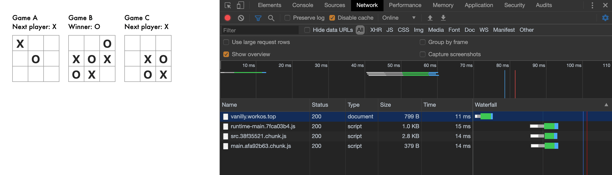
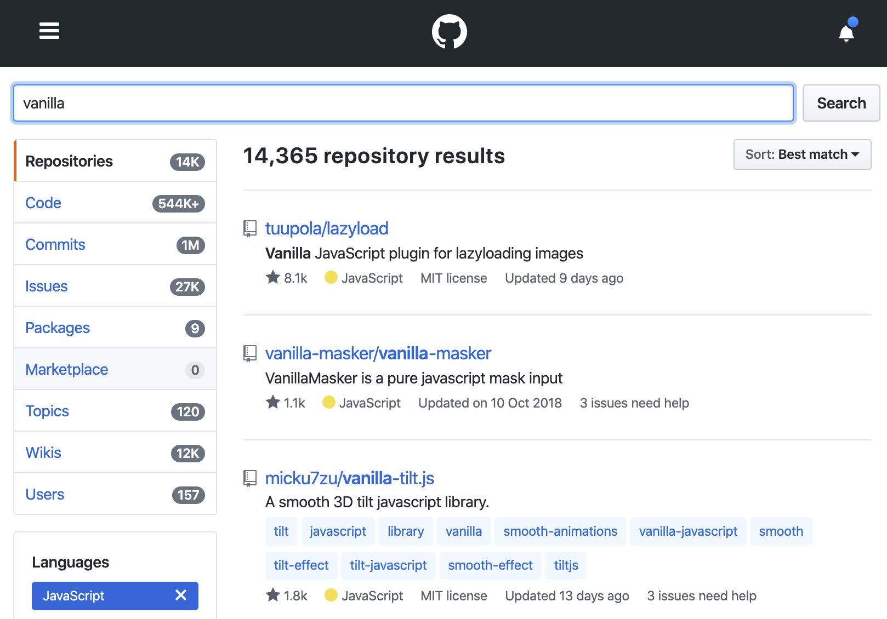

# vanilly

A VanillaJS Framework, No component, No state, No diff VDOM.

# Gesundheit: DOM is browser's state, browser's state is UI state


**No React, No Vue, Easy SPA**

Tiny, Clear and Light size:

| Compress type | Size |
| ------------- | ---- |
| No Gzip       | 5k   |
| Gzip          | 2.5k |

Feature:

- Chain declarative UI
- Only element helper functions

## Install

Use unpkg:

```html
<script src="https://unpkg.com/vanilly@0.4.1/umd/index.js"></script>
```

Or use npm:

```sh
npm i --save vanilly
# or
yarn add vanilly
```

## Example

**Register css:**

```js
import $ from 'vanilly';

$.css(`.red-box {background:#f00;}`);
```

**Chain declarative UI:**

```js
import $ from 'vanilly';

const box = $('div')
  .$id('box')
  .$text('hello')
  .$class('red-box')
  .$append(
    $('h2').$text(`I'm a title`),
    $('input').$val(`I'm a input`),
    $('button').$text(`I'm a button`),
    $('a').$text(`I'm a <a />`),
  );

// render in dom
document.body.append(box);
```

**Extends any element:**

```js
import $ from 'vanilly';

const oldBox = document.getElementById('box');

const box = $(oldBox);
box.$text('hello');

document.body.append(box);
```

**Bind data:**

```js
import $ from 'vanilly';
import Observer from 'vanilla-observer';

const obs = Observer({ value: '' });

const inputA = $('input').$on('input', function(e) {
  obs.update(s => (s.value = e.target.value));
});

const inputB = $('input').$on('input', function(e) {
  obs.update(s => (s.value = e.target.value));
});

// Listen obs.update, and when inputA remove auto unListen it
obs.connectElement(inputA, s => {
  inputA.value = s.value;
});

obs.connectElement(inputB, s => {
  inputB.value = s.value;
});

document.body.append(inputA, inputB);
```

## Tutorial

Here have recode `https://reactjs.org/tutorial/tutorial.html`



```js
import $ from 'vanilly';
import { calculateWinner } from './utils/calculateWinner';
import './css';

// pure-component
const Square = (val: number) => {
  return $('button')
    .$class('square')
    .$text(val);
};

// board, Lifting State up here
const Board = (name: string) => {
  const squares = Array(9).fill(null);
  const status = 'Next player: X';
  let xIsNext = true;

  const handleClick = (i: number) => {
    if (squares[i] || calculateWinner(squares)) {
      return;
    }
    squares[i] = xIsNext ? 'X' : 'O';

    xIsNext = !xIsNext;
    updateGameStatus();
  };

  const renderSquare = (i: number) => {
    return Square(squares[i]).$on('click', function() {
      handleClick(i);
      this.$replace(renderSquare(i));
    });
  };

  const updateGameStatus = () => {
    const winner = calculateWinner(squares);
    let status: string;

    if (winner) {
      status = `Winner: ${winner}`;
    } else {
      status = `Next player: ${xIsNext ? 'X' : 'O'}`;
    }

    game.$query('#status', el => el.$text(status));
  };

  const game = $('div').$append(
    $('div').$text(name),
    $('div')
      .$id('status')
      .$class('status')
      .$text(status),
    $('div')
      .$class('board-row')
      .$append(renderSquare(0), renderSquare(1), renderSquare(2)),
    $('div')
      .$class('board-row')
      .$append(renderSquare(3), renderSquare(4), renderSquare(5)),
    $('div')
      .$class('board-row')
      .$append(renderSquare(6), renderSquare(7), renderSquare(8)),
  );

  return game;
};

// Game application, render some board
const Game = () => {
  return $('div')
    .$class('game')
    .$append(
      $('div')
        .$class('game-board')
        .$append(Board('Game A')),
      $('div')
        .$class('game-board')
        .$append(Board('Game B')),
      $('div')
        .$class('game-board')
        .$append(Board('Game C')),
    );
};

document.body.append(Game());
```

## Ecology

> All vanilla.js packages can use vanilly

Because vanilly is vanilla.js's helper functions

We created some vanilla.js packages:

- [vanilla-route](https://github.com/ymzuiku/vanilla-route)
- [vanilla-observer](https://github.com/ymzuiku/vanilla-observer)
- [vanilla-list](https://github.com/ymzuiku/vanilla-list)
- [vanilla-icon](https://github.com/ymzuiku/vanilla-icon)
- [vanilla-message](https://github.com/ymzuiku/vanilla-message)
- [vanilla-device](https://github.com/ymzuiku/vanilla-device)

You can search other packages in github: https://github.com/search?q=vanilla



> We have a very large ecosystem :)
