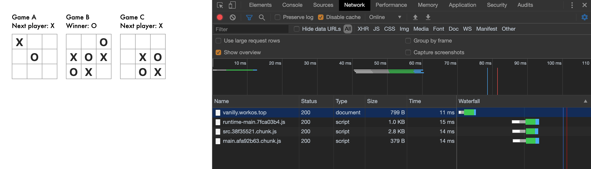

# vanilla-document

Use VanillaJS chained declarative UI, No lifecycle, No state, No diff VDOM.

# Gesundheit: `UI=fn(state)` -> `UI=browser(DOM)`


**No React, No Vue, Easy SPA**

| Compress type | Size |
| ------------- | ---- |
| No Gzip       | 5k   |
| Gzip          | 2.5k |

Feature:

- Zero dependencies
- Freedom, you can use any design mode
- Fast, no diff VDOM pay expenses
- Chained declarative UI (Like JSX or Flutter ?)
- Only element helper functions
- Easy create css and use BEM in Javascript
- Support IE 9 (precondition add core.Set polyfill and `vanilla-document/umd/dom-polyfill`)

## Install

Use unpkg:

```html
<script src="https://unpkg.com/vanilla-document@0.4.12/umd/index.js"></script>
```

Or use npm:

```sh
npm i --save vanilla-document
# or
yarn add vanilla-document
```

## Example

**Register css:**

```js
import dom from 'vanilla-document';

dom.css(`.red-box {background:#f00;}`);
```

**Chain declarative UI:**

```js
import dom from 'vanilla-document';

const box = dom('div')
  .$id('box')
  .$text('hello')
  .$class('red-box')
  .$append(
    dom(h2').$text(`I'm a title`),
    dom('input').$val(`I'm a input`),
    dom('button').$text(`I'm a button`),
    dom('a').$text(`I'm a <a />`),
  );

// render in dom
document.body.append(box);
```

**Extends any element:**

```js
import dom from 'vanilla-document';

const oldBox = document.getElementById('box');

const box = dom(oldBox);
box.$text('hello');

document.body.append(box);
```

**Bind data:**

```js
import dom from 'vanilla-document';
import Observer from 'vanilla-observer';

const obs = Observer({ value: '' });

const inputA = dom('input').$on('input', function(e) {
  obs.update(s => (s.value = e.target.value));
});

const inputB = dom('input').$on('input', function(e) {
  obs.update(s => (s.value = e.target.value));
});

// Listen obs.update, and when inputA remove auto unListen it
obs.connectElement(inputA, s => {
  inputA.value = s.value;
});

obs.connectElement(inputB, s => {
  inputB.value = s.value;
});

document.body.append(inputA, inputB);
```

## Tutorial

Here have recode React Tutorial: `https://reactjs.org/tutorial/tutorial.html`

All code in `2.8kb`, It have: vanilla-document, CSS, src/\*.ts:



Tutorial Demo: [vanilla-document.workos.top](http://vanilla-document.workos.top)

```js
import dom from 'vanilla-document';
import { calculateWinner } from './utils/calculateWinner';
import './css';

// pure-component
const Square = (val: number | string, onClick: Function) => {
  return dom('button')
    .$class('square')
    .$text(val)
    .$on('click', function() {
      const v = onClick(this);
      // Use new data rerender self
      this.$replace(Square(v, onClick));
    })
    .$hover({
      background: '#f5f5f5',
    });
};

// board, Lifting State up here
const Board = (name: string) => {
  const squares = Array(9).fill(null);
  const status = 'Next player: X';
  let xIsNext = true;

  const handleClick = (i: number) => {
    if (squares[i] || calculateWinner(squares)) {
      return;
    }
    squares[i] = xIsNext ? 'X' : 'O';

    xIsNext = !xIsNext;
    updateGameStatus();
  };

  const renderSquare = (i: number) => {
    return Square('', () => {
      handleClick(i);
      return squares[i];
    });
  };

  const updateGameStatus = () => {
    const winner = calculateWinner(squares);
    let status: string;

    if (winner) {
      status = `Winner: ${winner}`;
    } else {
      status = `Next player: ${xIsNext ? 'X' : 'O'}`;
    }

    game.$query('#status', el => el.$text(status));
  };

  const game = dom('div').$append(
    dom('div').$text(name),
    dom('div')
      .$id('status')
      .$class('status')
      .$text(status),
    dom('div')
      .$class('board-row')
      .$append(renderSquare(0), renderSquare(1), renderSquare(2)),
    dom('div')
      .$class('board-row')
      .$append(renderSquare(3), renderSquare(4), renderSquare(5)),
    dom('div')
      .$class('board-row')
      .$append(renderSquare(6), renderSquare(7), renderSquare(8)),
  );

  return game;
};

// Game application, render some board
const Game = () => {
  return dom('div')
    .$class('game')
    .$append(
      dom('div')
        .$class('game-board')
        .$append(Board('Game A')),
      dom('div')
        .$class('game-board')
        .$append(Board('Game B')),
      dom('div')
        .$class('game-board')
        .$append(Board('Game C')),
    );
};

document.body.append(Game());
```

## APIs

### Root api

use \$.xxx:

| name     | params                                             | description                                      |
| -------- | -------------------------------------------------- | ------------------------------------------------ |
| css      | css:string; BEM?:string                            | insert css in document, and use BEM replace `.^` |
| style    | src?:string; textContent?:string; onload?:Function | insert script or textContext in document         |
| randomId | none                                               | Create random id                                 |

### Element api

use \$(element).xxx:

| name                   | params                                                                                     | description                                                                           |
| ---------------------- | ------------------------------------------------------------------------------------------ | ------------------------------------------------------------------------------------- |
| \$ref                  | fn:(ele: this)=>any                                                                        | Get element                                                                           |
| \$id                   | id:string                                                                                  | Set element.id                                                                        |
| \$props                | obj:object                                                                                 | Set element[key] = value                                                              |
| \$getProp              | key:string; callback:(value:any)=>any                                                      | Get element[key], and callback                                                        |
| \$text                 | text:string                                                                                | Create <span>{text}</span>, and append to element                                     |
| \$getText              | fn:(text:string)=>any                                                                      | Get \$text created span.textContent                                                   |
| \$val                  | val:any                                                                                    | Set element.value                                                                     |
| \$html                 | html:string                                                                                | Set element.innerHtml                                                                 |
| \$query                | seletor:string; callback:(node:Element)=>any; unfindable?:()=>any                          | element.querySelector and callback, if unfind, callback unfindable                    |
| \$queryAll             | seletor:string; callback:(nodes:Element[])=>any                                            | element.querySelectorAll and callback                                                 |
| \$before               | newNode:Element                                                                            | insert node before element                                                            |
| \$beforeQuery          | selector:string; newNode:Element; unfindable?:()=>any                                      | element.querySelector and insert node before element, if unfind, callback unfindable  |
| \$insert               | position: 'beforebegin' \| 'afterbegin' \| 'beforeend' \| 'afterend', newNode:Element      | run element.insertAdjacentElement                                                     |
| \$append               | ...nodes:any[]                                                                             | element.append some elements                                                          |
| \$children             | fn:(children:Elements)=>any                                                                | Get element.children                                                                  |
| \$childWith            | fn:(child:Element, index: number)=>any                                                     | ForEach element.children                                                              |
| \$parent               | fn:(node:Element)=>any                                                                     | Get element.parent                                                                    |
| \$attr                 | key:string, value: any                                                                     | Set or remove element attribute                                                       |
| \$cssText              | cssText:string                                                                             | Set element.style.cssText                                                             |
| \$class                | cssText:string; BEM?:string;                                                               | Set element.className, and use BEM replace `^` string                                 |
| \$classAdd             | cssText:string; BEM?string;                                                                | Add a class in element classList                                                      |
| \$classRemove          | cssText:string; BEM?string;                                                                | Remove a class in element classList                                                   |
| \$classReplace         | cssText:string; BEM?string;                                                                | Replace a class in element classList                                                  |
| \$classContains        | cssText:string; fn:(isHave:boolean)=>any; BEM?string;                                      | Get contains a class in element classList                                             |
| \$style                | obj:CSSStyle                                                                               | Set element.style with object                                                         |
| \$checkAppend (slowly) | fn :(self:this)=>any; timeOut?:nubmer                                                      | check element is append in document with timeOut's time                               |
| \$checkRemove (slowly) | fn :(self:this)=>any; timeOut?:nubmer                                                      | check element is remove in document with timeOut's time                               |
| \$replace              | node:any                                                                                   | Use node replace self                                                                 |
| \$replaceChild         | nextNode:any, oldNode:any                                                                  | Use element replace a self child element                                              |
| \$replaceWith          | fn: (oldNode:any, index:number)=>any                                                       | ForEach self children and replace new element                                         |
| \$on                   | type:string; listener:(ev:HTMLElementEvent)=>any                                           | Set event to element, like element.onclick = fn                                       |
| \$addEvent             | type:string; listener:(ev:HTMLElementEvent)=>any; options: boolean \| EventListenerOptions | addEventListener to element                                                           |
| \$removeEvent          | type:string, listener:(ev:HTMLElementEvent)=>any; options: boolean \| EventListenerOptions | removeEventListener to element                                                        |
| \$pseudo               | inEvent: string \| null, outEvent: string \| null, obj: IStyle                             | Use event realize `Pseudo Classes`                                                    |
| \$hover                | obj: IStyle                                                                                | Equa ('div').\$pseudo('onmouseenter', 'onmouseleave', {...style})                     |
| \$focus                | obj: IStyle                                                                                | Equa ('div').\$pseudo('onfocus', 'onblur', {...style})                                |
| \$active               | obj: IStyle                                                                                | Equa ('div').\$pseudo('onmousedown/ontouchstart', 'onmouseup/ontouchend', {...style}) |
| \$media                | checker:boolean\|string, obj: IStyle                                                       | like @media pseudo                                                                    |

## Ecology

> All vanilla.js packages can use vanilla-document

Because vanilla-document is vanilla.js's helper functions

If your need create a vanilla.js package, please don't dependencies other vanilla.js, only use `BOM` and `DOM` APIs, This will ensure that it will stand the test of time.

We created some vanilla.js packages, there very tiny(1kb~5kb), and zero dependencies:

- [vanilla-document](https://github.com/ymzuiku/vanilla-document)
- [vanilla-route](https://github.com/ymzuiku/vanilla-route)
- [vanilla-observer](https://github.com/ymzuiku/vanilla-observer)
- [vanilla-http](https://github.com/ymzuiku/vanilla-http)
- [vanilla-list](https://github.com/ymzuiku/vanilla-list)
- [vanilla-icon](https://github.com/ymzuiku/vanilla-icon)
- [vanilla-message](https://github.com/ymzuiku/vanilla-message)
- [vanilla-device](https://github.com/ymzuiku/vanilla-device)
- [vanilla-style](https://github.com/ymzuiku/vanilla-style)
- [vanilla-cssjs](https://github.com/ymzuiku/vanilla-cssjs)
- [vanilla-spring](https://github.com/ymzuiku/vanilla-spring)

You can search other packages in github: https://github.com/search?q=vanilla-document


> We have a very large ecosystem :)
